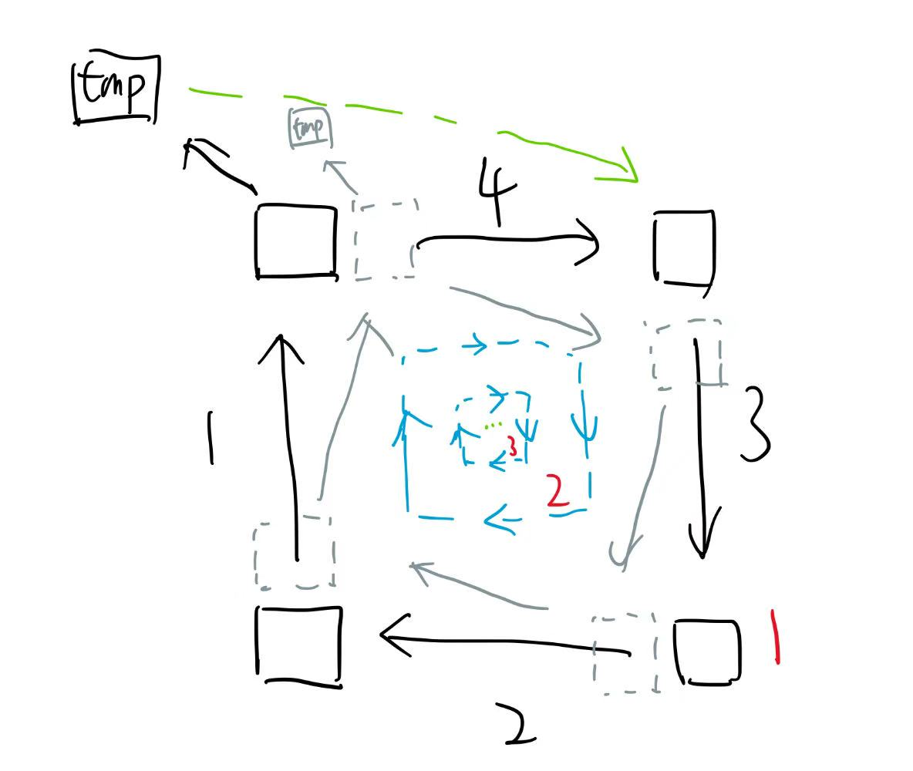

# LeetCode_48：旋转图像

省流：给个矩阵，顺时针旋转90度，打印旋转后的二维矩阵，最好原地旋转

# 解答

从外到内，每次处理一圈，每次循环时从4个角依次“顺时针”遍历，就像下面这张图


```java
public class code48 {
    public void rotate(int[][] matrix) {
        // R: row  C: col
        int tR = 0;
        int tC = 0;
        int dR = matrix.length - 1;
        int dC = matrix.length - 1;
        while (tR < dR) {   // 从外到里，每次一个函数打印一圈
            int times = dC - tC;
            int tmp = 0;
            for (int i = 0; i != times; i++) {   // 轮流四个位置交换
                tmp = matrix[tR][tC + i];
                matrix[tR][tC + i] = matrix[dR - i][tC];  // 上面一行从左边拿
                matrix[dR - i][tC] = matrix[dR][dC - i];  // 左边一行从下面拿
                matrix[dR][dC - i] = matrix[tR + i][dC];  // 下面一行从右边拿
                matrix[tR + i][dC] = tmp;                 // 右边那行不能从上边拿，被覆盖了，得从tmp拿
            }
            tR++; tC++; dR--; dC--;  // 向内缩一圈
        }
    }
}
```